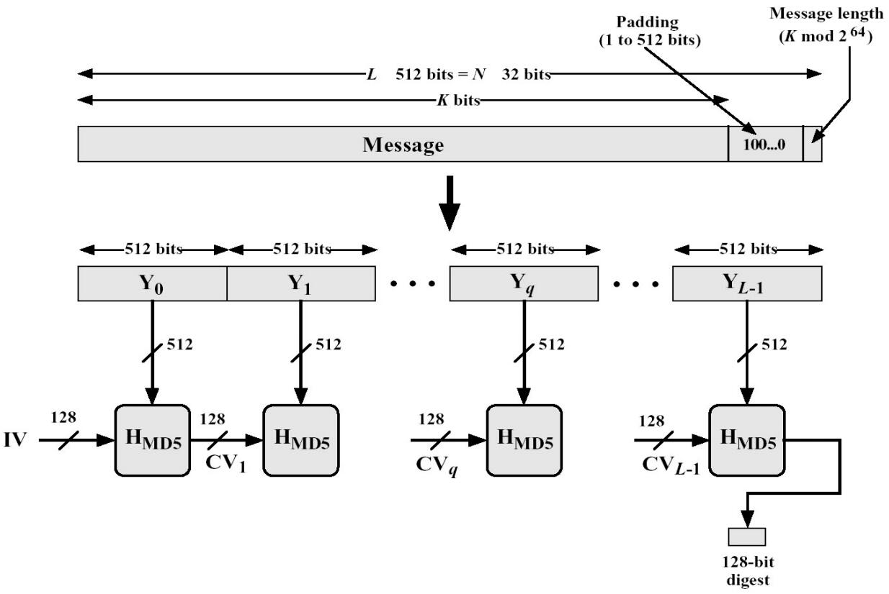

# Md5

## Algorithm



## Show me how MD5 works for password protection.

考虑MD5的工作原理是如何进行所谓密码保护。比如登录一个网站，用户输入自己的用户名和密码，然后服务器将该密码进行MD5处理获取到摘要，再将这个摘要和数据库中存储的摘要进行比对，如果一直，则可以认为该用户密码输入正确。这样也保证了具体密码服务器也不知道，保证了用户密码的安全性和隐私性。

## how to use

```javascript
const md5 = require('./dist/md5algorithm.min');
console.log(md5.hash('你好'));

// output: 7ECA689F0D3389D9DEA66AE112E5CFD7
```

## test

```bash
npm run test
```